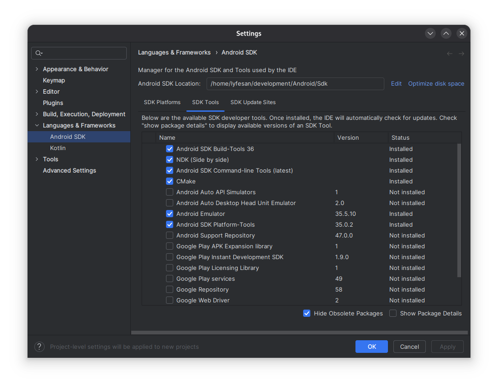
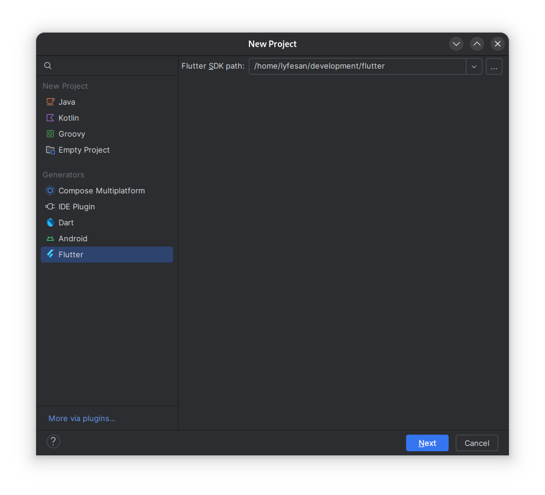
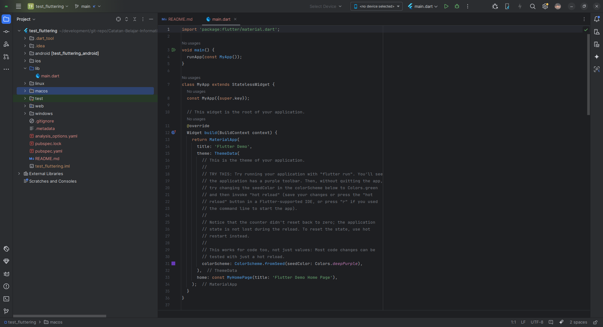

# Flutter Installation

This note will show you how to install and create a new flutter projects in [Android Studio](https://developer.android.com/studio)

## Table of Contents
- [Install Android Studio](#install-android-studio)
- [Install Flutter](#install-flutter)
- [Set Up Project in Android Studio](#set-up-project-in-android-studio)
- [Optional: Set Up Flutter MinSDK and NDK Version](#optional-set-up-flutter-minsdk-and-ndk-version)

## Install Android Studio

Download the latest Android Studio [here](https://developer.android.com/studio)

After installation, open Android Studio and go to SDK Manager. Make sure all of these tools are installed:
- Android SDK Platform (numbered latest version preferred)
- Android SDK Command-line Tools
- Android SDK Build-Tools
- Android SDK Platform-Tools
- Android Emulator



Don't forget to install Flutter plugin so that we can create new flutter project in Android Studio.

## Install Flutter

You can refer to this [documentation](https://docs.flutter.dev/get-started/install/) for more information regarding installing flutter on specific OS. In this note, I will show you the general way to install flutter(assuming all prerequisite tools already installed in linux/MacOS) on windows, linux, and MacOS.

### 1. Download Flutter SDK

You can find all release of flutter SDK [here](https://docs.flutter.dev/release/archive). I recommend choosing stable channel build version.

### 2. Extract and Install Flutter SDK

Extract the file into the directory you want to store the Flutter SDK. Usually I choose ```~/development``` in linux or ```C:\Users\{username}\development```/```D:\development``` in windows. 

### 3. Configure Flutter and Set Up Development Environment

After that, you need to include flutter into your environment path. In windows you can do that using default ```Environment Variables``` tools and put in in system path. For linux, open your shell config file, for example ```~/.bashrc``` or ```~/.bash_profile``` and add this line:

```bash
export PATH="{your-flutter-sdk-path}/bin:$PATH"
```

then reload your current shell using command:

```bash
source ~/.bashrc
```

You can check your flutter installation by running this command in cmd/terminal:
```bash
flutter doctor -v
```

Afterward, you need to agree to android licenses by typing this command:
```bash
flutter doctor --android-licenses
```
Then, you can continue to create your new flutter project in Android Studio.

## Set Up Project in Android Studio

Create new flutter project and follow the wizard. Make sure the Flutter SDK Path points to your flutter sdk directory. 

 
Voila! You have created new flutter project. Now you can start creating your flutter apps inside ```lib``` directory



## Optional: Set Up Flutter MinSDK and NDK Version

If you try to run your apps, you may encounter ndk version too low or if you try to use firebase in your project, you will encounter minsdk needs to be API 23. In the time of writing this article, it is because current flutter stable version set the minSDK to be 18 and ndk version to 26.x.xxx. You have two ways to solve this problem, either by changing the flutter sdk config or change your gradle project config.

### 1. Change Gradle Config inside Project
Open file ```android/app/build.grade.kts``` inside your project and change the following lines from this:
```kotlin
android {
    ...
    ndkVersion = flutter.ndkVersion
    ...
    defaultConfig {
        ...
        minSdk = flutter.minSdkVersion
        ...
    }
}
```
to this:
```kotlin
android {
    ...
    ndkVersion = "27.0.12077973" // Change to minimum version needed
    ...
    defaultConfig {
        ...
        minSdk = 23 // Min SDK for using Firebase
        ...
    }
}
```

### 2. Change Flutter SDK Config

This is my preferred way, because this will affect to all my newly created projects, not just individual project. For flutter version 3.13 and above, you can head to your flutter installation and go to file ```packages/flutter_tools/gradle/src/main/groovy```. Find this line and changed it to:
```groovy
class FlutterExtension {
    
    ...
    
    public final int minSdkVersion = 23
    
    ...

    public final String ndkVersion = "27.0.12077973"

    ...
}
```
This will change the ```flutter.minSdkVersion``` to 23 (for firebase) and ```flutter.ndkVersion``` to minimum version needed

### References

- https://docs.flutter.dev/get-started/install
- https://stackoverflow.com/questions/52060516/flutter-how-to-change-android-minsdkversion-in-flutter-project
