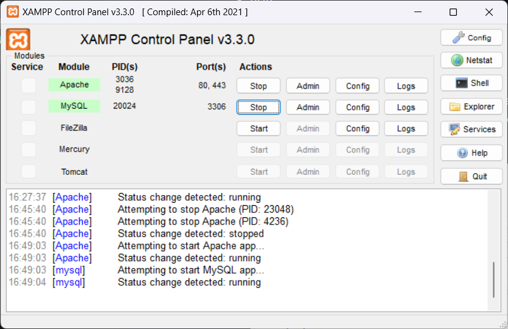
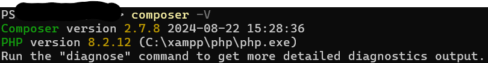
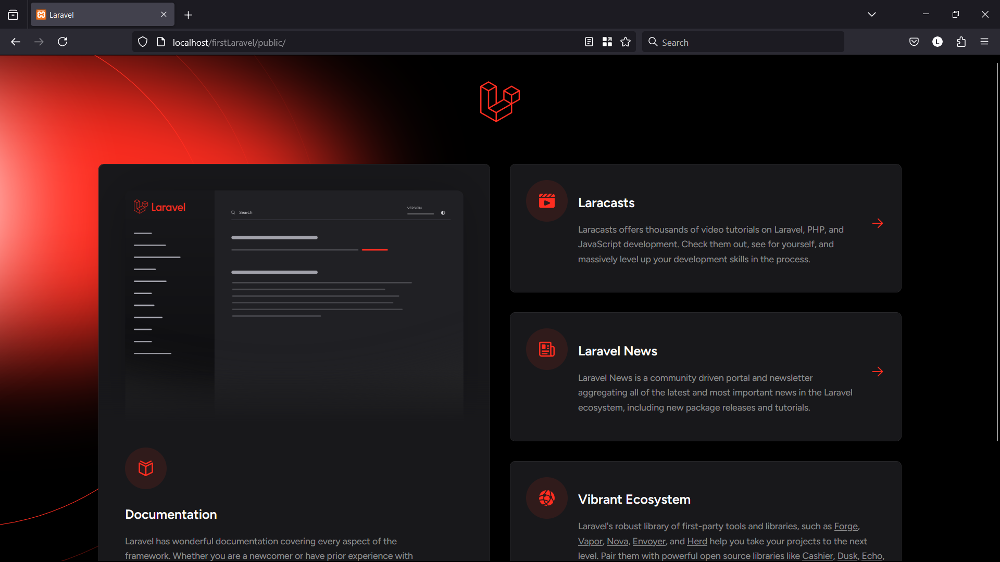

# Laravel Installation

This note shows you how to create a laravel project and download required software to get it running. The requirements are:
- Web server (apache or nginx) 
- PHP
- Composer (dependency manager for PHP)

## Windows

### 1. Install XAMPP 
For the sake of simplicity, we use XAMPP that already includes webserver(apache) and PHP inside it. Download it [here](https://www.apachefriends.org/download.html). Choose any version you need and run the installer (I usually put xampp path in ```C:\xampp```). You can verify installation by opening XAMPP Control Panel and try to start Apache and MySQL.<br><br>


### 2. Install Composer
After xampp installed , you can install composer simply by download [this file](https://getcomposer.org/Composer-Setup.exe) and run the installer. It will install the latest composer version and set up the path variable so you can call it globally. Its default installation is in ```C:\ProgramData\ComposerSetup\bin```. For other installation options please refer to this [documentation](https://getcomposer.org/doc/00-intro.md). Verify installation by typing ```composer -V``` in cmd or powershell.<br><br>


### 3. Creating New Laravel Project
To create laravel project, we are using ```composer```. There are two ways to create laravel project, by directly using ```composer``` or via laravel installer from composer.

- To create laravel project directly, you can use composer ```create-project``` command:
    ```sh
    composer create-project laravel/laravel app-name
    ```
    It will create project using latest version of laravel. You can also specified which laravel version to use:
    ```sh
    composer create-project laravel/laravel app-name "10.*"
    ```
    It will create project using latest version of laravel 10.x
- You also can create laravel project using composer laravel installer package
    ```sh
    composer global require laravel/installer

    laravel new app-name 
    ```
    You will be asked various question regarding what your new project should be. Follow it until the end.

Voila! You have created your new laravel project

### 4. Local Server Deployment

There are two ways to display your new laravel project to web browser. Either using xampp or artisan.

- #### Artisan Local Server Deployment 
    Locate your new project directory, then execute this command
    ```sh
    php artisan serve 
    ```
    To access your project, open your web browser and type http://localhost:8000

- #### XAMPP Local Server Deployment 
    Create or move your existing project to your htdocs directory inside your xampp installation folder (Usually ```C:\xampp\htdocs```). To access it, type http://localhost/app-name/public . Change ```app-name``` with your project name and there you go.




References:
- https://laravel.com/docs/installation
- https://getcomposer.org/doc/00-intro.md
- https://www.apachefriends.org/ 